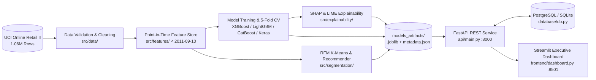
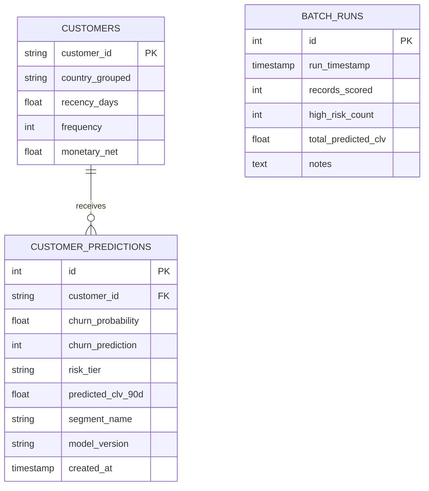
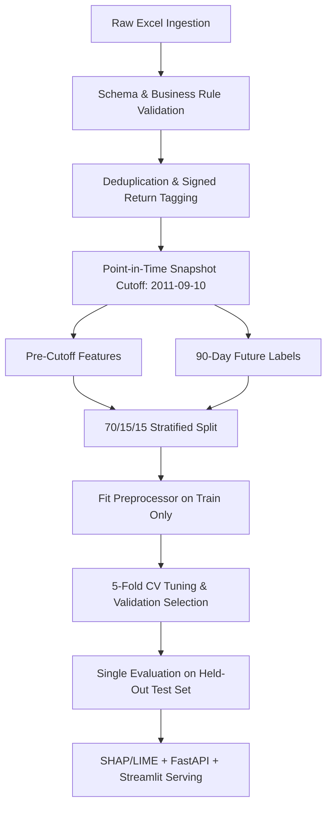

# Vantara Retail Solutions — Architecture, ER & ML Workflow Diagrams

## 1. End-to-End System Architecture

```mermaid
flowchart LR
    RAW[(UCI Online Retail II\n1.06M Rows)] --> CLEAN[Data Validation & Cleaning\nsrc/data/]
    CLEAN --> FEAT[Point-in-Time Feature Store\nsrc/features/ < 2011-09-10]
    FEAT --> TRAIN[Model Training & 5-Fold CV\nXGBoost / LightGBM / CatBoost / Keras]
    FEAT --> SEG[RFM K-Means & Recommender\nsrc/segmentation/]
    TRAIN --> XAI[SHAP & LIME Explainability\nsrc/explainability/]
    TRAIN --> ART[(models_artifacts/\n.joblib + metadata.json)]
    SEG --> ART
    XAI --> ART
    ART --> API[FastAPI REST Service\napi/main.py :8000]
    API <--> DB[(PostgreSQL / SQLite\ndatabase/db.py)]
    API --> UI[Streamlit Executive Dashboard\nfrontend/dashboard.py :8501]
```

## 2. Database Entity-Relationship (ER) Diagram

```mermaid
erDiagram
    CUSTOMERS ||--o{ CUSTOMER_PREDICTIONS : receives
    CUSTOMERS {
        string customer_id PK
        string country_grouped
        float recency_days
        int frequency
        float monetary_net
    }
    CUSTOMER_PREDICTIONS {
        int id PK
        string customer_id FK
        float churn_probability
        int churn_prediction
        string risk_tier
        float predicted_clv_90d
        string segment_name
        string model_version
        timestamp created_at
    }
    BATCH_RUNS {
        int id PK
        timestamp run_timestamp
        int records_scored
        int high_risk_count
        float total_predicted_clv
        text notes
    }
```

## 3. Leakage-Safe ML Workflow

```mermaid
flowchart TD
    A[Raw Excel Ingestion] --> B[Schema & Business Rule Validation]
    B --> C[Deduplication & Signed Return Tagging]
    C --> D[Point-in-Time Snapshot Cutoff: 2011-09-10]
    D --> E[Pre-Cutoff Features]
    D --> F[90-Day Future Labels]
    E --> G[70/15/15 Stratified Split]
    F --> G
    G --> H[Fit Preprocessor on Train Only]
    H --> I[5-Fold CV Tuning & Validation Selection]
    I --> J[Single Evaluation on Held-Out Test Set]
    J --> K[SHAP/LIME + FastAPI + Streamlit Serving]
```